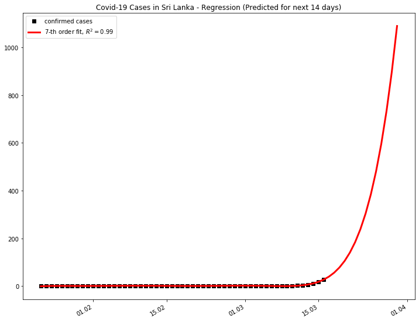

# COVID-19 Visualization and prediction - Sri Lanka

- [📈 LIVE DASHBOARD](https://covid19-sl.netlify.com/)

- [X] Crawler to scrape and cross-check data from different sources
- [X] Visualize data - [SEE HERE](https://covid19-sl.netlify.com/)
- [X] Analyze by number of confirmed cases, deaths, recoviries and draw log scales[NOTEBOOK](./covid-19-analysis.ipynb)
- [X] Calculate Linear Regression and R2 Score, coefficients and R2 scores using scikit-learn models
- [X] Plot Regression for next 14 days

## Data Sources:
- [John Hopkins CSSE](https://github.com/CSSEGISandData/COVID-19/tree/master/csse_covid_19_data/csse_covid_19_time_series)
- [digitalhumanitarians](https://github.com/digitalhumanitarians/COVID-19LK)
